# Application Architecture Diagram

Below is a detailed diagram illustrating the application's architecture, key components, and workflows. This diagram is intended to help developers understand the project structure, data flow, and the roles of different files.

```mermaid
graph TD;
    classDef ui fill:#D6EAF8,stroke:#333,stroke-width:2px;
    classDef vm fill:#E8DAEF,stroke:#333,stroke-width:2px;
    classDef domain fill:#D1F2EB,stroke:#333,stroke-width:2px;
    classDef data fill:#FDEDEC,stroke:#333,stroke-width:2px;
    classDef llm fill:#FDEBD0,stroke:#333,stroke-width:2px;
    classDef core fill:#E5E7E9,stroke:#333,stroke-width:2px;

    %% === Core Application Setup ===
    subgraph "Core App Setup & Services"
        AppStart("<b>DocQAApplication.kt</b><br/><i>Role: Initializes the app,<br/>sets up Koin and ObjectBox</i>"):::core;
        DI("<b>AppModule.kt</b><br/><i>Role: Defines dependencies<br/>for the entire app (Koin)</i>"):::core;
        DBSetup("<b>ObjectBoxStore.kt</b><br/><i>Role: Initializes the<br/>ObjectBox vector database</i>"):::data;
        DataModels("<b>DataModels.kt</b><br/><i>Role: Defines data structures<br/>like DocumentEntity & ChunkEntity</i>"):::data;
        AppStart --> DI;
        AppStart --> DBSetup;
    end

    %% === Document Ingestion Pipeline ===
    subgraph "Workflow 1: Document Ingestion (Adding Knowledge)"
        direction LR;
        IngestUI("<b>DocsScreen.kt</b><br/><i>Role: UI for user to select<br/>and upload PDF/DOCX files</i>"):::ui;
        IngestVM("<b>DocsViewModel.kt</b><br/><i>Role: Handles the logic for<br/>document processing</i>"):::vm;
        
        subgraph "File Processing"
            Readers("<b>Readers.kt / PDFReader.kt</b><br/><i>Role: Extracts text content<br/>from document files</i>"):::domain;
            Splitter("<b>WhiteSpaceSplitter.kt</b><br/><i>Role: Splits the extracted text<br/>into smaller chunks</i>"):::domain;
        end

        Embedding("<b>SentenceEmbeddingProvider.kt</b><br/><i>Role: Converts text chunks<br/>into vector embeddings using<br/>all-MiniLM-L6-V2.onnx</i>"):::domain;
        
        subgraph "Database Storage"
            DocsDB("<b>DocumentsDB.kt</b><br/><i>Role: Stores metadata<br/>about each document</i>"):::data;
            ChunksDB_Store("<b>ChunksDB.kt</b><br/><i>Role: Stores text chunks<br/>and their vector embeddings</i>"):::data;
        end

        IngestUI -- "User selects file" --> IngestVM;
        IngestVM -- "1. Read File" --> Readers;
        Readers -- "2. Extracted Text" --> IngestVM;
        IngestVM -- "3. Split Text" --> Splitter;
        Splitter -- "4. Text Chunks" --> IngestVM;
        IngestVM -- "5. Generate Embeddings" --> Embedding;
        Embedding -- "6. Vector Embeddings" --> IngestVM;
        IngestVM -- "7. Store Document & Chunks" --> DocsDB;
        IngestVM -- " " --> ChunksDB_Store;
    end

    %% === RAG Inference Pipeline ===
    subgraph "Workflow 2: Q&A Inference (Using Knowledge)"
        direction LR;
        ChatUI("<b>ChatScreen.kt</b><br/><i>Role: UI for user to ask questions<br/>and see answers</i>"):::ui;
        ChatVM("<b>ChatViewModel.kt</b><br/><i>Role: Orchestrates the RAG<br/>pipeline to get an answer</i>"):::vm;
        
        Embedding2("<b>SentenceEmbeddingProvider.kt</b><br/><i>Role: Generates a vector<br/>embedding for the user's query</i>"):::domain;
        
        ChunksDB_Search("<b>ChunksDB.kt</b><br/><i>Role: Performs vector similarity search<br/>to find relevant chunks (context)</i>"):::data;

        subgraph "LLM Selection & Execution"
            LLMFactory("<b>LLMFactory.kt</b><br/><i>Role: Decides whether to use<br/>the local or remote LLM</i>"):::llm;
            LocalLLM("<b>LocalLLMAPI.kt</b><br/><i>Role: Runs local inference using<br/>MediaPipe and the downloaded model</i>"):::llm;
            RemoteLLM("<b>GeminiRemoteAPI.kt</b><br/><i>Role: Sends requests to the<br/>cloud-based Gemini API</i>"):::llm;
        end

        ChatUI -- "User asks question" --> ChatVM;
        ChatVM -- "1. Encode Query" --> Embedding2;
        Embedding2 -- "2. Query Vector" --> ChatVM;
        ChatVM -- "3. Find Similar Chunks" --> ChunksDB_Search;
        ChunksDB_Search -- "4. Retrieved Context" --> ChatVM;
        ChatVM -- "5. Select LLM" --> LLMFactory;
        LLMFactory -- "Chooses Local" --> LocalLLM;
        LLMFactory -- "Chooses Remote" --> RemoteLLM;
        LocalLLM -- "6. Generate Response" --> ChatVM;
        RemoteLLM -- " " --> ChatVM;
        ChatVM -- "7. Stream response to UI" --> ChatUI;
    end
    
    %% === LLM Model Management ===
    subgraph "LLM Model Management"
        direction TB
        ModelScreen("<b>ModelDownloadScreen.kt</b><br/><i>Role: UI for downloading and<br/>managing the local LLM model</i>"):::ui;
        ModelVM("<b>ModelDownloadViewModel.kt</b><br/><i>Role: Handles download logic<br/>and progress updates</i>"):::vm;
        ModelManager("<b>ModelManager.kt</b><br/><i>Role: Manages the actual<br/>downloading and storage of the<br/>.task model file</i>"):::llm;
        
        ModelScreen --> ModelVM;
        ModelVM --> ModelManager;
        ModelManager --> LocalLLM("Affects LocalLLM");
    end

    %% === Overall Connections ===
    DBSetup --> ChunksDB_Store;
    DBSetup --> DocsDB;
    DBSetup --> ChunksDB_Search;
    DI --> IngestVM;
    DI --> ChatVM;
    DI --> ModelVM;
``` 

